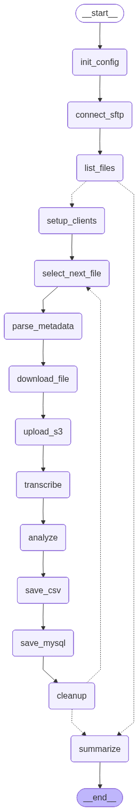
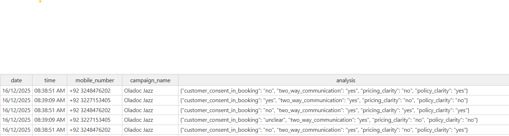
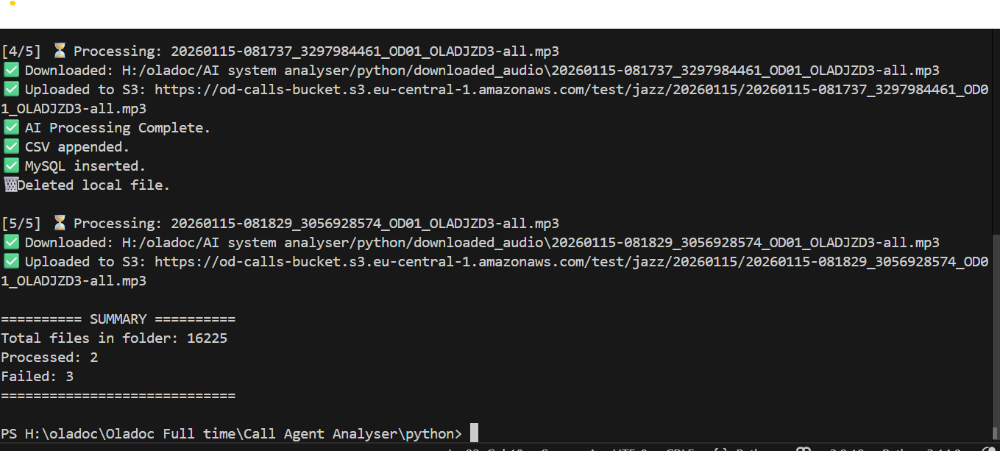
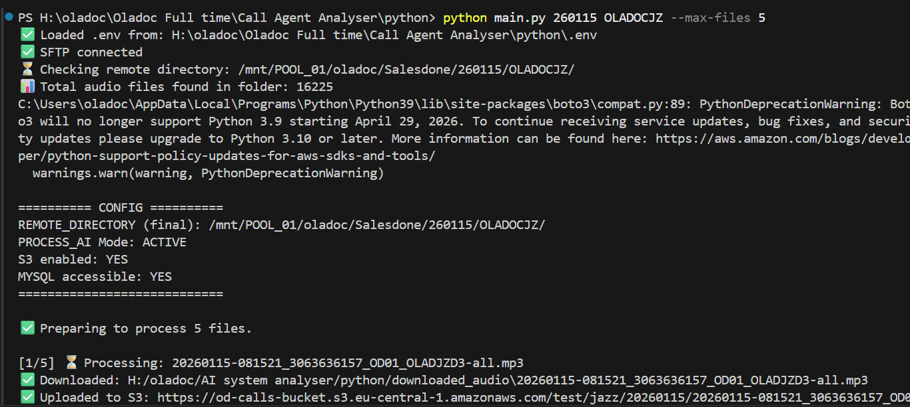

# 📞 AI Call Compliance Auditing Pipeline — 8,000 Recordings/Day

> **Production LangGraph pipeline** that automatically audits 8,000+ 
> daily call recordings for consent verification and script compliance 
> — built to solve a real CEO-level business crisis at Pakistan's 
> largest digital health platform.


---

## 🚨 The Problem — A CEO-Level Crisis

The company operates **50 call agents** who contact customers daily to 
present subscription plans — offering healthcare services charged 
directly to JazzCash mobile accounts.

The process requires **explicit verbal consent** from the customer 
before any subscription is booked. But complaints began flooding 
in — **hundreds daily** — from customers claiming their JazzCash 
accounts were being charged without their consent. Agents were 
booking subscriptions regardless of whether the customer agreed.

The CEO called me into his office and laid out the problem:
> *"We need to know which agents are booking without consent. 
> We have 50 agents, 8,000 calls per day — we cannot review 
> these manually. Build something that audits every single call."*

There was no existing QA system. Everything was manual — 
impossible at this scale.

---

## ✅ The Solution — Automated AI Compliance Auditing

I built an end-to-end LangGraph pipeline that:
1. **Connects to the call center SFTP server** and pulls all 
   recordings automatically
2. **Transcribes every call** using Groq Whisper STT
3. **Runs an LLM compliance agent** that evaluates each call for:
   - ✅ Did the customer give clear verbal consent?
   - ✅ Did the agent follow the correct script?
   - ✅ Was the subscription booked correctly?
   - ✅ Were JazzCash charges explained clearly?
4. **Flags non-compliant calls** and generates a detailed report
5. **Sends flagged calls to the QA team** for agent accountability

---

## 📊 Production Impact

| Metric | Value |
|--------|-------|
| Call recordings processed daily | 8,000+ |
| Wrong booking complaints reduced | 80% |
| Unauthorized subscriptions reduced | 70% |
| Manual QA team replaced | ✅ Fully automated |
| Agents audited daily | 50 |
| Deployment | AWS · Docker · Production |

---

## 🏗️ LangGraph Pipeline Architecture



> **Intelligent batch processing loop** — connects to SFTP, lists 
> all recordings, processes each file through a 
> transcription → analysis → storage pipeline, loops until 
> all files are processed, then generates a daily compliance summary.

---


## 🤖 Compliance Evaluation Criteria

Each call is scored by the LLM agent on:

| Check | Description |
|-------|-------------|
| 🎯 Consent Verification | Did customer give clear verbal consent? |
| 📋 Script Adherence | Did agent follow approved script? |
| 💰 Charge Explanation | Were JazzCash charges explained clearly? |
| 🔊 Tone & Conduct | Was agent professional and non-pressuring? |
| ✅ Correct Booking | Was subscription booked accurately? |

---

## 🛠️ Tech Stack

| Layer | Technology |
|-------|-----------|
| Pipeline Orchestration | LangGraph |
| STT Transcription | Groq Whisper |
| Compliance Analysis | GPT-4o, LangChain |
| File Ingestion | SFTP Pipeline |
| Cloud Storage | AWS S3 |
| Database | MySQL + CSV |
| Backend | FastAPI, Python |
| Deployment | Docker, AWS |

---

## 📁 Folder Structure

```
├── README.md
├── architecture/
│   └── system-architecture.png
└── results/
    └── sample-compliance-report/
```

## 🎙️ Sample Input — Real Call Recordings

> Two anonymized sample call recordings from the production pipeline:

[📞 Sample Call 1](audio_inputs/20251210-083039_3007141073_....)
[📞 Sample Call 2](audio_inputs/20251210-083759_3064844144_....)

---

## 📊  Results

### Compliance Analysis Output




### 🎥 Pipeline Demo Video
[](results/Video%20processing%20.mp4)

---

> ⚠️ **Note:** This repository showcases the architecture and 
> design of a production compliance system.
---

## 📫 Contact

**Adnan Abdullah** — Agentic AI Engineer & AI Team Lead

[](https://linkedin.com/in/adnan-abdullah-700899b)
[](mailto:muhammad.adnannust@gmail.com)

---

*Built with Groq Whisper + GPT-4o · Processing 8,000+ calls daily · 
80% reduction in wrong booking complaints*
